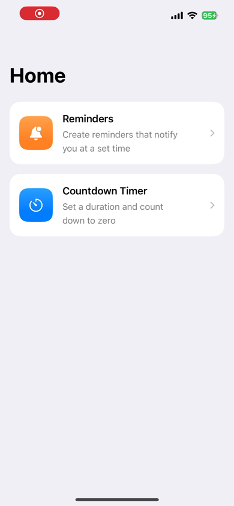
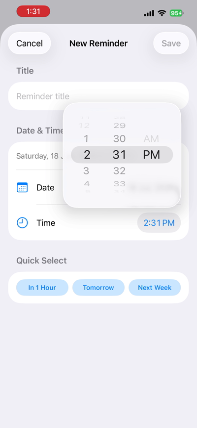
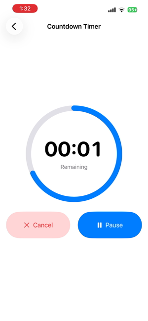
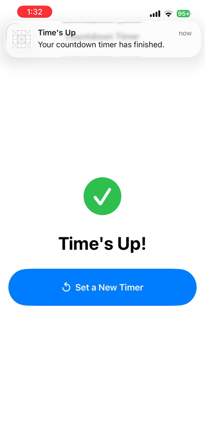

# RemindTimer

A simple iOS app with two focused tools in one place: **Reminders** that notify you at a set date/time, and a **Countdown Timer** that counts down to zero and alerts you when it's done. Built with SwiftUI, backed by a local SQLite database, and powered by iOS's native notification system.

<p align="center">
  
  
  
  
</p>

## Features

**Reminders**
- Create, edit, and delete reminders with a title and a date/time
- Native-style date and time pickers, plus one-tap "In 1 Hour" / "Tomorrow" / "Next Week" quick-select options
- Each reminder schedules a real local notification that fires at the chosen time, even if the app isn't open
- Swipe to delete, with automatic cancellation of the matching notification

**Countdown Timer**
- Pick a duration in minutes and seconds with a wheel picker
- Live circular progress ring while the timer runs, with pause/resume/cancel controls
- Schedules a "Time's Up" notification for the exact moment the timer finishes, so you're told even if the app is backgrounded
- Clear "Time's Up!" screen when the countdown reaches zero

## Tech Stack

- **SwiftUI** for the entire UI, using a single `NavigationStack` from a Home screen into each feature
- **MVVM** architecture — `ReminderListViewModel` and `CountdownTimerViewModel` own state and logic; views stay declarative
- **SQLite** (Apple's built-in `SQLite3` C library, no third-party dependency) for reminder persistence
- **UserNotifications** framework for all local notifications, wrapped in a single `NotificationManager`
- **os.Logger** for structured, filterable logging throughout the app
- Swift 6 / strict concurrency, with `@MainActor` as the project default and `nonisolated` used explicitly where a type does plain synchronous I/O (`ReminderDatabase`)

## Project Structure

```
NotificationApp/
├── NotificationAppApp.swift        # App entry point
├── ContentView.swift                # Home screen (feature picker)
├── Models/
│   └── Reminder.swift                # Reminder data model
├── ViewModels/
│   ├── ReminderListViewModel.swift   # Reminders state + CRUD
│   └── CountdownTimerViewModel.swift # Timer state + ticking
├── Views/
│   ├── RemindersView.swift           # Reminders list screen
│   ├── ReminderRow.swift             # One reminder row
│   ├── AddEditReminderView.swift     # Add/edit reminder form
│   └── CountdownTimerView.swift      # Countdown timer screen
└── Services/
    ├── NotificationManager.swift     # Schedules/cancels local notifications
    ├── ReminderDatabase.swift        # SQLite persistence for reminders
    └── ReminderStore.swift           # (unused) earlier JSON-file storage, kept for reference
```

## Requirements

- Xcode 16 or later
- iOS 17+ deployment target
- Swift 6

## Getting Started

1. Clone the repo and open `NotificationApp.xcodeproj` in Xcode.
2. **Link SQLite** — select the project → the app target → *Build Phases* → *Link Binary With Libraries* → add `libsqlite3.tbd`. This is required since `ReminderDatabase` uses SQLite's C API directly.
3. Build and run on a simulator or device.
4. On first launch, allow notifications when prompted — both features rely on local notifications to alert you.

## How Notifications Work

Both features go through the same `NotificationManager`:
- Reminders schedule a `UNCalendarNotificationTrigger` for the exact date/time chosen, keyed by the reminder's own id.
- The countdown timer schedules a `UNTimeIntervalNotificationTrigger` for the remaining seconds when started, and cancels it if paused or reset.

Permission is requested once, the first time the Reminders screen appears, using iOS's standard system prompt.
